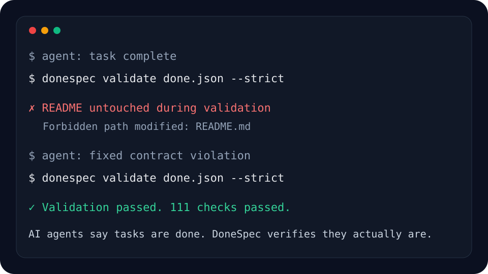

# DoneSpec

**AI agents say tasks are done.**

**DoneSpec verifies they actually are.**

DoneSpec is the deterministic completion layer for AI coding agents.

It turns ?done? into a local, repeatable, machine-checkable contract.

<p align="center">
  
</p>

---

## The problem

AI coding agents are fast, but their definition of completion is often conversational.

They can say:

> Done.

while tests fail, required files are missing, forbidden files changed, docs were skipped, or a CI contract was silently weakened.

DoneSpec fixes that by making completion deterministic.

```text
Done means deterministically verified.
```

---

## Demo

See the core DoneSpec failure-and-recovery demo:

[docs/demo.md](docs/demo.md)

Run locally:

```bash
./scripts/demo-forbidden-file.sh
```

Windows PowerShell:

```powershell
.\\scripts\\demo-forbidden-file.ps1
```

---

## Install

```bash
pip install donespec
```

Check the installed version:

```bash
donespec --version
```

DoneSpec `0.7.0` is available on PyPI:

```text
https://pypi.org/project/donespec/0.7.0/
```

GitHub release:

```text
https://github.com/xryv/DoneSpec/releases/tag/v0.7.0
```

---

## 60-second quickstart

Create a DoneSpec contract in a project:

```bash
donespec init --yes
```

Run validation:

```bash
donespec validate done.json
```

For serious agent workflows, use the stricter gate:

```bash
donespec validate done.json --strict
```

Inspect what the contract requires without executing checks:

```bash
donespec explain done.json
```

Add a check safely:

```bash
donespec add-check done.json --type file_exists --name "README exists" --path README.md
```

---

## Example `done.json`

```json
{
  "$schema": "done.schema.json",
  "version": "1.0",
  "task_id": "ship-safe-change",
  "must_pass": [
    {
      "type": "command",
      "name": "tests pass",
      "run": "pytest -q"
    },
    {
      "type": "regex_in_file",
      "name": "README explains DoneSpec",
      "path": "README.md",
      "pattern": "deterministic completion layer"
    }
  ],
  "must_not": [
    {
      "type": "file_not_modified",
      "name": "lockfile untouched",
      "path": "uv.lock"
    }
  ]
}
```

This file is the completion contract.

An agent can modify code however it wants, but it cannot honestly claim completion until the contract passes.

---

## Example CLI output

```text
DoneSpec validation: ship-safe-change

? tests pass  (812.4ms)
? README explains DoneSpec  (0.6ms)
? lockfile untouched  (34.1ms)

Validation passed. 3 checks passed.
Exit code: 0
```

Failure is explicit:

```text
DoneSpec validation: ship-safe-change

? tests pass  (804.8ms)
? lockfile untouched  (31.5ms)
  Forbidden path modified: uv.lock

Validation failed.
1 check failed.
Exit code: 1
```

---

## GitHub Action usage

Use DoneSpec as a completion gate in CI:

```yaml
name: DoneSpec

on:
  pull_request:
  push:
    branches:
      - main

jobs:
  donespec:
    runs-on: ubuntu-latest
    steps:
      - uses: actions/checkout@v4

      - uses: xryv/DoneSpec@v0.7.0

      - name: Validate completion contract
        run: donespec validate done.json --strict
```

This makes the contract visible to humans, agents, and CI.

---

## Why deterministic validation matters

AI coding agents are probabilistic.

Production systems are not.

DoneSpec creates a small deterministic layer between agent output and human trust:

```text
agent claims ? done.json contract ? deterministic checks ? pass/fail result
```

That means:

- completion is inspectable
- requirements are explicit
- CI can enforce the same contract locally
- agents can reason from a stable target
- humans can review what ?done? actually means

DoneSpec is not AI magic.

It is deterministic infrastructure.

---

## AI agent integration

DoneSpec works with any coding agent because it does not require an agent runtime, API key, SaaS service, memory layer, or LLM dependency.

A useful agent instruction is:

```text
Before claiming completion, run:

donespec validate done.json --strict

If validation fails, the task is not complete.
Do not weaken done.json to make validation pass unless explicitly requested by the human.
```

Useful with:

- Codex
- Claude Code
- Cursor
- Aider
- OpenAI Agents SDK
- GitHub Actions
- local shell workflows
- multi-agent coding workflows

See:

- [docs/integrations.md](docs/integrations.md)
- [docs/agent-integration.md](docs/agent-integration.md)
- [docs/authoring.md](docs/authoring.md)

---

## Supported checks

| Check type          | Purpose                                      |
| ------------------- | -------------------------------------------- |
| `command`           | Run a shell command and verify the exit code |
| `file_exists`       | Require a file to exist                      |
| `regex_in_file`     | Require a pattern to exist in a file         |
| `regex_absent`      | Require a pattern to be absent from a file   |
| `file_not_modified` | Fail if a tracked file was modified          |
| `http_check`        | Check an HTTP endpoint response              |

DoneSpec is intentionally small.

The goal is not to model every workflow.

The goal is to provide a minimal, deterministic completion contract that composes with everything else.

---

## Strict mode

Strict mode validates the quality of `done.json` before executing checks:

```bash
donespec validate done.json --strict
```

It catches issues such as:

- empty contracts
- unnamed checks
- duplicate check names
- duplicate check IDs
- invalid regex patterns
- absolute paths
- parent traversal paths

See:

[docs/strict.md](docs/strict.md)

---

## Explain mode

Explain a contract without executing it:

```bash
donespec explain done.json
```

Emit machine-readable output:

```bash
donespec explain done.json --json
```

This is useful for agents, reviewers, and CI tooling that need to inspect the contract before execution.

See:

[docs/explain.md](docs/explain.md)

---

## Authoring mode

Safely add checks without manually editing JSON:

```bash
donespec add-check done.json --type command --name "tests pass" --run "pytest -q"
```

DoneSpec validates the updated contract before writing it.

See:

[docs/authoring.md](docs/authoring.md)

---

## Editor support

Use `done.schema.json` for editor validation and autocomplete:

```json
{
  "json.schemas": [
    {
      "fileMatch": [
        "/done.json"
      ],
      "url": "./done.schema.json"
    }
  ]
}
```

See:

[docs/editor-support.md](docs/editor-support.md)

---

## Schema support

Export the official JSON Schema:

```bash
donespec schema
donespec schema --write done.schema.json
```

Generated projects include:

```text
done.json
done.schema.json
```

This enables editor validation, autocomplete, CI validation, and agent-side contract inspection.

See:

[docs/schema.md](docs/schema.md)

---

## Templates

Initialize common contract shapes:

```bash
donespec templates
donespec init --template python --yes
donespec init --template node --yes
donespec init --template docs --yes
donespec init --template api --yes
```

See:

[docs/templates.md](docs/templates.md)

---

## Doctor

Inspect whether a project is DoneSpec-ready:

```bash
donespec doctor
donespec doctor --json
```

See:

[docs/doctor.md](docs/doctor.md)

---

## Init

Create DoneSpec files in a project:

```bash
donespec init --yes
```

See:

[docs/init.md](docs/init.md)

---

## Architecture

DoneSpec is deliberately boring:

```text
done.json
  ?
JSON Schema validation
  ?
optional strict semantic validation
  ?
checker registry
  ?
deterministic execution
  ?
structured validation report
  ?
exit code
```

There is no database.

No cloud service.

No dashboard.

No agent runtime.

No LLM dependency.

That is the point.

---

## Cross-platform verification

DoneSpec is intended to behave consistently across Windows, Linux, macOS, local shells, git hooks, and CI.

See:

[docs/cross-platform-verification.md](docs/cross-platform-verification.md)

---

## Roadmap to v1.0

The core is already capable.

The path to v1.0 is stabilization, not expansion:

- polished README
- demo GIFs and short recordings
- CLI wording refinement
- schema freeze
- documentation hardening
- cross-platform verification
- release checklist
- changelog
- final GitHub and PyPI release
- OSS launch assets

DoneSpec should remain tiny, local-first, deterministic, composable, and infrastructure-focused.

---

## Contributing

Contributions are welcome when they protect the minimal core.

Good contributions:

- improve determinism
- improve CLI clarity
- improve docs
- improve tests
- improve schema stability
- improve cross-platform behavior
- reduce ambiguity

Avoid contributions that turn DoneSpec into:

- an orchestration platform
- an AI framework
- a SaaS service
- an agent runtime
- a workflow engine
- a plugin marketplace
- a memory layer

The standard succeeds by staying small.

---

## Philosophy

AI agents should not be trusted because they sound confident.

They should be trusted when their work passes deterministic checks.

DoneSpec is a tiny primitive for that future.

Reliable.

Local.

Composable.

Deterministic.

Inevitable.
